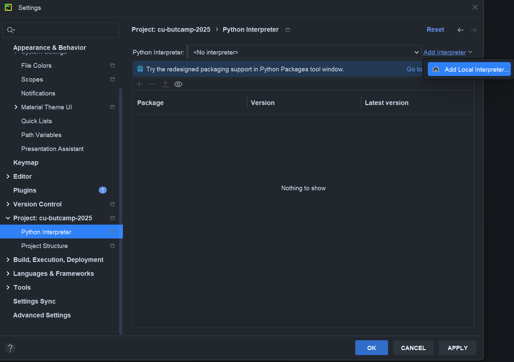
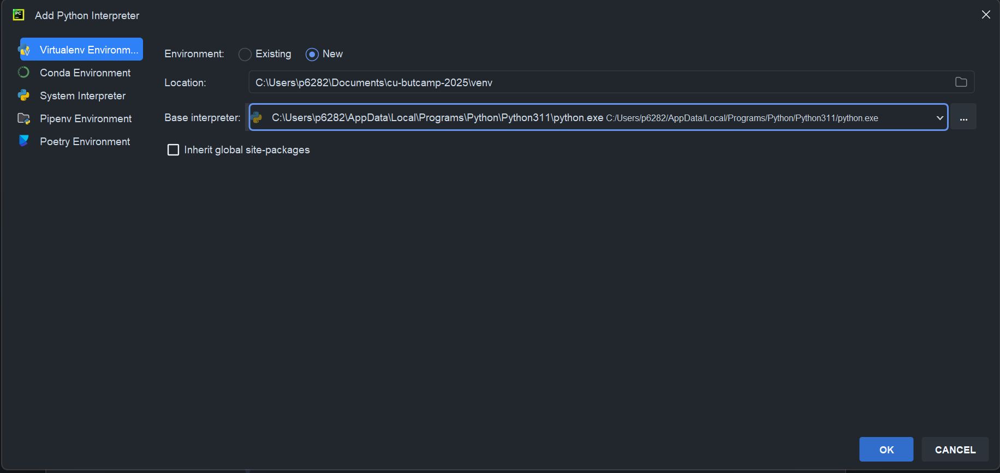
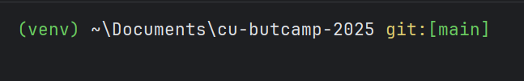
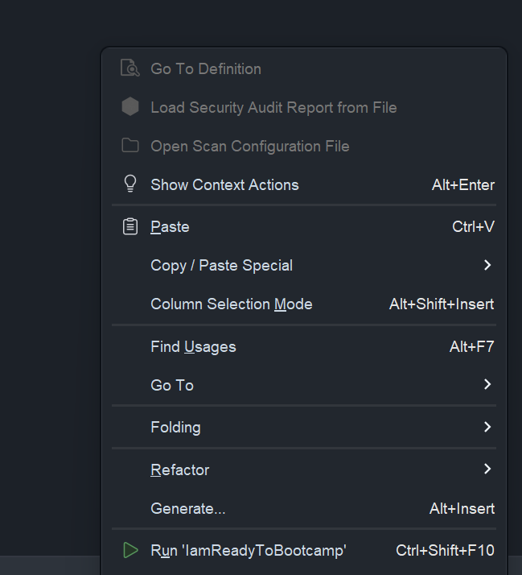

# PyCharm + Linux

## 1. Установка Python

1. Открой терминал.
2. Проверь, установлен ли Python:

```sh
python3 --version
```

1. Если Python **не установлен** или версия ниже 3.12, установи его:
    - **Ubuntu/Debian**:
        
        ```sh
        sudo apt update && sudo apt install -y python3 python3-venv python3-pip
        ```
        
    - **Arch Linux**:
        
        ```sh
        sudo pacman -Syu python
        ```
        
    - **Fedora**:
        
        ```sh
        sudo dnf install python3
        ```
        
4. Проверь успешную установку:

```sh
python3 --version
```

Если видишь `Python 3.12.x` – всё ок! 🎉

---

## 2️. Установка Git и клонирование репозитория

1. Проверь, установлен ли Git:

```sh
git --version
```

1. Если Git **не установлен**, установи его:
    - **Ubuntu/Debian**:
        
        ```sh
        sudo apt install -y git
        ```
        
    - **Arch Linux**:
        
        ```sh
        sudo pacman -S git
        ```
        
    - **Fedora**:
        
        ```sh
        sudo dnf install git
        ```
        
3. Перейди в нужную директорию:

```sh
cd your_dir
```

1. Склонируй репозиторий:

```sh
git clone https://github.com/MikD1/tg-bots-gpt-bootcamp.git
```

1. Перейди в папку проекта:

```sh
cd cu-butcamp-2025
```


## 3️. Установка PyCharm

1. Скачай PyCharm с [официального сайта](https://www.jetbrains.com/pycharm/download/).
2. Установи его, следуя инструкциям для своего дистрибутива.
3. Запусти PyCharm и открой в нем папку с клонированным репозиторием.

---

## 4. Добавление интерпретатора в PyCharm

1. Открой PyCharm и выбери проект.
2. Перейди в **File** → **Settings** → **Project: cu-butcamp-2025** → **Python Interpreter**.
3. Нажми **Add Interpreter** → **Add Local Interpreter**.





5. Выбери **venv** и укажи путь до установленного Python (обычно определяется автоматически).



6. Нажми **OK** и дождись завершения настройки.

---

## 5. Запуск виртуального окружения

1. Открой терминал в PyCharm или используй системный терминал.
2. Создай и активируй виртуальное окружение:

```sh
source venv/bin/activate
```

3. Убедись, что в начале строки появился `(venv)`.



---

## 6️. Установка зависимостей

Если ты правильно склонировал репозиторий, то у тебя есть файл `requirements.txt`, установи все нужные пакеты командой:

```sh
pip3 install -r requirements.txt
```

---

## 7️. Запуск `IamReadyToBootcamp.py`

Запусти свой скрипт одной из команд:

```sh
python IamReadyToBootcamp.py
```

или

```sh
python3 IamReadyToBootcamp.py
```

или через PyCharm (**ПКМ по файлу `IamReadyToBootcamp.py` → Run `IamReadyToBootcamp.py`**).




Если программа **НЕ** вывела

`[status: OK] УРА! Все работает!`

иди к следующему пункту.

---

## 8️. Ошибки

|Ошибка|Как решить|
|---|---|
|версия Python должна быть минимум 3.12|Установи нужную версию с [сайта](https://www.python.org/downloads/release/python-3120/)|
|Пропущенные библиотеки: <название>|Команда`pip3 install <название>` или`pip3 install -r requirements.txt`|
|Библиотеки с ошибкой в версии: <название>|Команда`pip3 install <название>==<версия>`|

Если у тебя другая ошибка, обратись в чат!
