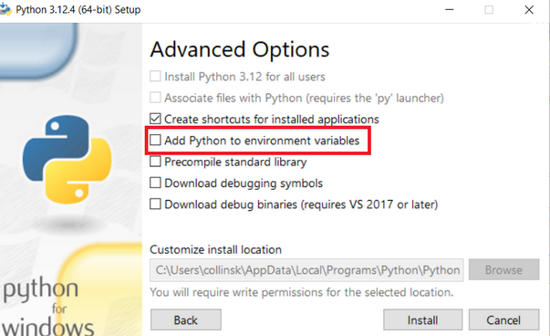

## 1. Установка Python

1. Перейди на [официальный сайт Python](https://www.python.org/downloads/).
2. Скачай Python версии 3.12 для своей операционной системы.
3. Запусти установщик и **обязательно** поставь галочку "Add Python to PATH".




4. Дождись завершения установки.
5. (может потребоваться перезапустить компьютер)

Проверить успешную установку можно командой в терминале:

```sh
python --version
```

или

```sh
python3 --version
```

Если видишь `Python 3.12.x` – всё ок! 🎉

---

## 2. Установка Git и клонирование репозитория

1. Скачай и установи Git с [официального сайта](https://git-scm.com/downloads).
2. Проверь установку командой:

```sh
git --version
```

1. Перейди в нужную директорию

```bash
cd your_dir
```

1. Склонируй нужный репозиторий:

```sh
git clone https://github.com/MikD1/tg-bots-gpt-bootcamp.git
```

1. Перейди в папку с проектом:

```sh
cd cu-butcamp-2025
```

---

## 3. Установка PyCharm

1. Скачай PyCharm с [официального сайта](https://www.jetbrains.com/pycharm/download/).
2. Установи и запусти его.
3. Открой в PyCharm папку с клонированным репозиторием.

---

## 4. Добавление интерпретатора в PyCharm

1. Открой PyCharm и создай новый проект (или используй уже клонированный).
2. Перейди в **File** → **Settings** → **Project: cu-butcamp-2025>** → **Python Interpreter**.
3. Нажми **Add Interpreter** → **Add Local Interpreter**.


4. Выбери **venv**, а в поле "Base Interpreter" укажи путь до Python (обычно определяется автоматически).


5. Нажми "OK", "apply" и дождись завершения настройки.

---

## 5. Запуск виртуального окружения

Открой терминал в PyCharm


Если у тебя нет `(venv)` в начале, пропиши  

```sh
venv\Scripts\activate
```

---

## 6. Установка зависимостей из `requirements.txt`

Если ты правильно склонировал репозиторий, то у тебя есть файл `requirements.txt`, установи все нужные пакеты командой:

```sh
pip3 install -r requirements.txt
```

---

## 7. Запуск `IamReadyToBootcamp.py`

Теперь запусти свой скрипт:

```sh
python IamReadyToBootcamp.py
```

или

```shell
python3 IamReadyToBootcamp.py
```

или через PyCharm (**ПКМ по файлу `IamReadyToBootcamp.py` → Run `IamReadyToBootcamp`**)


Если программа **НЕ** вывела

`[status: OK] УРА! Все работает!`

Переходи к следующему пункту 

## 7. Ошибки

Допустимые ошибки:

| Ошибка                                    | Как решить                                                                             |
| ----------------------------------------- | -------------------------------------------------------------------------------------- |
| версия питона должна быть минимум 3.12    | Скачать нужную версию с [сайта](https://www.python.org/downloads/release/python-3120/) |
| Пропущенные библиотеки: <название>        | Команда<br>`pip3 install <название>` <br>или<br>`pip3 install -r requirements.txt`     |
| Библиотеки с ошибкой в версии: <название> | Команда<br>`pip3 install <название>==<версия>`                                         |
Если у тебя другая ошибка, обратись с этим в чат
