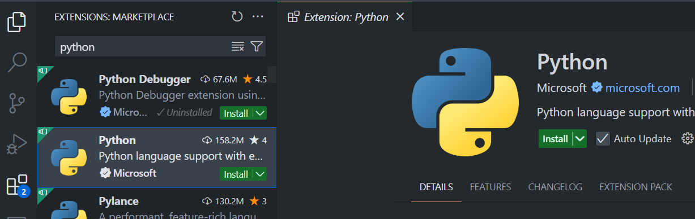
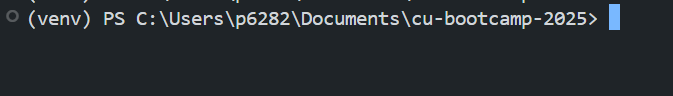
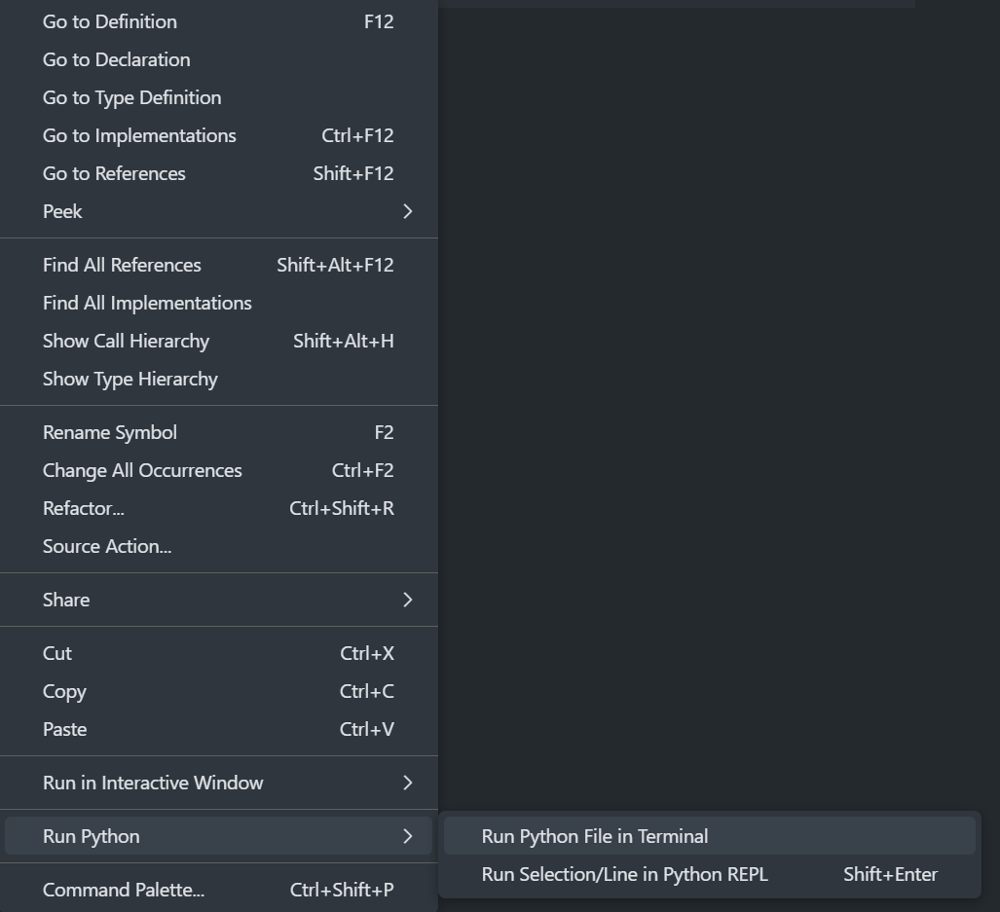

## 1. Установка Python

### Ubuntu/Debian

```sh
sudo apt update && sudo apt install -y python3 python3-venv python3-pip
```

### Arch Linux

```sh
sudo pacman -Syu python python-virtualenv python-pip
```

### Fedora

```sh
sudo dnf install -y python3 python3-virtualenv python3-pip
```

Проверить успешную установку можно командой:

```sh
python3 --version
```

Если видишь `Python 3.12.x` – всё ок! 🎉


---

## 2. Установка Git и клонирование репозитория

### Ubuntu/Debian

```sh
sudo apt install -y git
```

### Arch Linux

```sh
sudo pacman -Syu git
```

### Fedora

```sh
sudo dnf install -y git
```

Проверить установку:

```sh
git --version
```

Клонирование репозитория:

```sh
cd your_dir
git clone https://github.com/MikD1/tg-bots-gpt-bootcamp.git
cd cu-butcamp-2025
```


---

## 3. Установка VS Code

### Ubuntu/Debian

```sh
sudo apt install -y wget gpg
wget -qO- https://packages.microsoft.com/keys/microsoft.asc | gpg --dearmor | sudo tee /usr/share/keyrings/packages.microsoft.gpg > /dev/null
echo "deb [arch=amd64 signed-by=/usr/share/keyrings/packages.microsoft.gpg] https://packages.microsoft.com/repos/code stable main" | sudo tee /etc/apt/sources.list.d/vscode.list > /dev/null
sudo apt update && sudo apt install -y code
```

### Arch Linux

```sh
sudo pacman -Syu code
```

### Fedora

```sh
sudo rpm --import https://packages.microsoft.com/keys/microsoft.asc
dnf config-manager --add-repo https://packages.microsoft.com/yumrepos/vscode
dnf install -y code
```

Запусти VS Code:

```sh
code
```


---

## 4. Установка расширения Python в VS Code

1. Открой **VS Code**.
2. Перейди в **Extensions** (Ctrl+Shift+X).
3. Найди **Python** от Microsoft.
4. Нажми "Install".




---

## 5. Создание виртуального окружения

1. Открой VS Code и выбери папку проекта (**File** → **Open Folder...** → выбери `cu-butcamp-2025`).
2. Открой **Терминал** (**Terminal** → **New Terminal** или `Ctrl+`` ).
3. Создай виртуальное окружение:

```sh
python3 -m venv venv
```

4. Активируй его:

```sh
source venv/bin/activate
```

5. Убедись, что в начале строки появился `(venv)`.



---

## 6. Установка зависимостей из `requirements.txt`

```sh
pip3 install -r requirements.txt
```

---

## 7. Запуск `IamReadyToBootcamp.py`

```sh
python3 IamReadyToBootcamp.py
```

или через VS Code:

- Открыть `IamReadyToBootcamp.py`.
- Нажать `F5` или `Run` → `Run Without Debugging`.



Если программа **НЕ** вывела

`[status: OK] УРА! Все работает!`

иди к следующему пункту.

---

## 8. Ошибки

|Ошибка|Как решить|
|---|---|
|версия Python должна быть минимум 3.12|Установи нужную версию с [сайта](https://www.python.org/downloads/)|
|Пропущенные библиотеки: <название>|Команда`pip3 install <название>` или`pip3 install -r requirements.txt`|
|Библиотеки с ошибкой в версии: <название>|Команда`pip3 install <название>==<версия>`|

Если у тебя другая ошибка, обратись в чат!
