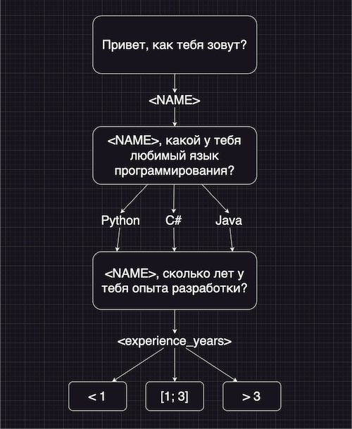

# Задания, часть 3

[Пример кода](state_bot.py)

### Задание 3.1

Необходимо узнать у пользователя количество лет опыта и дать ему совет исходя из его любимого языка и опыта.

### Задание 3.2

Если у пользователя больше 10 лет опыта, бот не должен давать совет пользователю, а попросить пользователя дать совет боту, а затем поблагодарить его.

### Задание 3.3

Необходимо сделать выбор языка программирования пользователем с помощью кнопок в боте
- https://docs.aiogram.dev/en/latest/api/types/reply_keyboard_markup.html